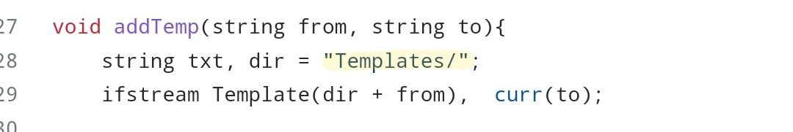

## Just add the templates or functions you need in your code

**Hello, every competitive programmer 🖐**, It occurred to me that many competitors leave a lot of templates and functions in their code to solve problems in contests fast, **but** If there is someone who wants to read your code after that to learn from you or understand the idea of the problem?  Won't he have difficulties?
I think he gets a little annoyed and gets lost between existing templates and functions, **and for that**, I made this repository, **To solve problems in contests fast with clean and ordinary code.**

----

After some changes will you make in your working  directory, all you need is to write this line code with the function or template you need and the file you are working on : 

    addTemplate(Template name, Current file);

**but now,** what are these changes?

1. **First,** add the (addTemplate.h) file to your working directory. 

---

2. **Then,** you need to create a Template folder also in your working directory to save all templates and functions in it.
**But note,** If you need to change the folder name, also you need to change it in addTemplate.h file **(change dir variable)**:

    **addTemplate.h &rarr; addTemp** function **&rarr; dir = "Templates/"**
    
      

----

3. **Finally**, create cpp file, and add in it the following lines code : 
 -
        #ifndef ONLINE_JUDGE
        #include "addTemplate.h"
        #endif

- 
       void addTemplate(string s, string t){ 
            #ifndef ONLINE_JUDGE
            addTemp(s, t);
            #endif
        }

      
    
----

### Watch this video to make the idea clearer 
https://user-images.githubusercontent.com/68350433/224569266-40c0be8f-9a7f-4152-a59f-deabe95cbab9.mp4

