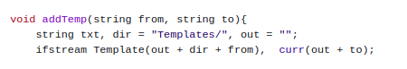
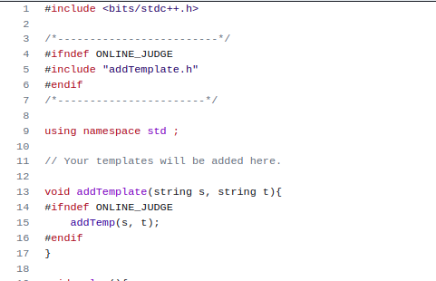

## Just add the templates or functions you need in your code

**Hello, every competitive programmer 🖐**

It occurred to me that most contestants add many templates and functions in their code so that if they face any problem during the contest and need something from them immediately, they can use it, this will save them time instead of going to get that template and copying and adding it to their code. **But,** If there is someone who wants to read the code after that to understand the idea of the problem? **Won't he have difficulties understanding and tracing the code?**

I think he gets a little annoyed and wastes time looking for the functions or templates used in the code.

Although most IDEs have features that make it easier, copying codes to an IDE every time to understand the problem is a time-consuming process, and it's best to read the code from the website itself **for that**, I made this repository: **To solve problems in contests fast with clear and ordinary code.**

----

After some changes will you make in your working  directory, all you need is to write this line code with the function or template you need and the file you are working on : 

    addTemplate(Template name, Current file);

**but now,** what are these changes?

1. **First,** add the (addTemplate.h) file to your working directory. 

---

2. **Then,** you need to create a Template folder also in your working directory to save all templates and functions in it.
**But note,** If you need to change the folder name, also you need to change it in addTemplate.h file **(change dir variable)**:

    **addTemplate.h &rarr; addTemp** function **&rarr; dir = "Templates/"**
    
      
    
    🔴 **NOTICE THAT!**
    > If you use **clion** ide and add this folder and files out cmake folder, You should write **"../"** before the folder and files path name.
    To change it go to
        **addTemplate.h** then, **addTemp function** after that, check if the **out variable** is equal to **"../"** or not, if not, change it.

----

3. **Finally**, create cpp file, and add in it the following lines code : 
 -
        #ifndef ONLINE_JUDGE
        #include "addTemplate.h"
        #endif

- 
       void addTemplate(string s, string t){ 
            #ifndef ONLINE_JUDGE
            addTemp(s, t);
            #endif
        }

      
    
----

### Watch this video to make the idea clearer 
https://user-images.githubusercontent.com/68350433/224569266-40c0be8f-9a7f-4152-a59f-deabe95cbab9.mp4

